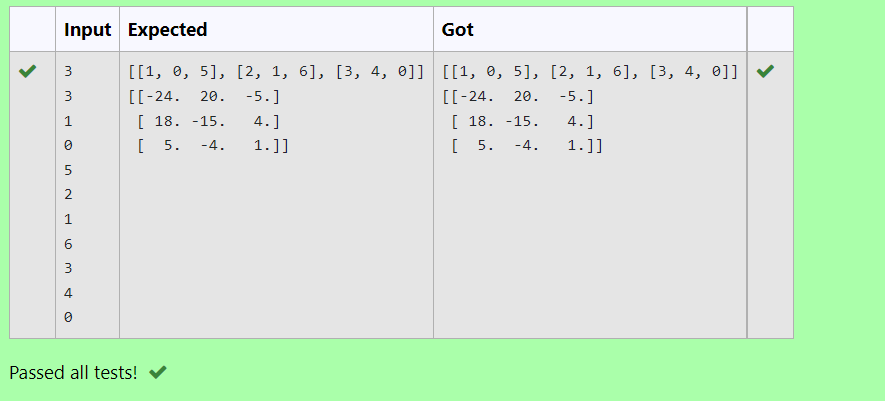

# Inverse-of-matrix

## AIM:
To write a python program to find inverse a matrix.
## ALGORITHM:
### Step 1:
Start python program
### Step 2:
Import numpy and create two empty lists.
### Step 3:
Get the parameters and the elements from the user using for loops.
### Step 4:
Inverse the matrix using linalg library.
### Step 5:
Get the output.
## PROGRAM:
```
Created by : Harini.B
Register Number : 212221230035

import numpy as np
l1,l2=[],[]
r,c=int(input()),int(input())
for i in range(r):
    for j in range(c):
        num=int(input())
        l1.append(num)
    l2.append(l1)
    l1=[]
print(l2)
value1=np.array(l2)
inverse=np.linalg.inv(value1)
print(inverse)
```

## OUTPUT:


## RESULT:
A python program to find inverse a matrix has been executed successfully.
